# Crypto Dashboard Architecture

## System Architecture Diagram

```mermaid
graph TB
    %% External Data Sources
    subgraph External["🌐 External Data Sources"]
        CGAPI["🚀 CG\nCoinGecko\nMarket Data"]
        BNAPI["💱 BN\nBinance\nTrading Info"]
        WHAPI["🐳 WA\nWhaleAlert\nTransaction Tracking"]
    end

    %% Frontend Application
    subgraph FE["💻 User Interface"]
        UI["🖥️ Dashboard\nCrypto Insights"]
        WS["📡 WebSocket\nLive Streaming"]
        Redux["📊 State Mgmt\nData Handling"]
    end

    %% API Gateway
    API["🔐 API Gateway\nRequest Routing"]

    %% Microservices
    subgraph Services["🔧 Microservices"]
        AUTH["👤 User Service\nAuth & Management"]
        MARKET["💹 Market Service\nPrice Analysis"]
        WHALE["🐬 Whale Tracker\nTransaction Monitor"]
        PORT["💼 Portfolio\nInvestment Tracking"]
        NOTIF["🔔 Notification\nReal-time Alerts"]
        ANAL["📈 Analytics\nMarket Insights"]
    end

    %% Data Layer
    subgraph Data["💾 Data Infrastructure"]
        REDIS["🚄 Redis\nFast Caching"]
        PGSQL["🗃️ PostgreSQL\nPersistent Storage"]
        KAFKA["📨 Kafka\nEvent Streaming"]
    end

    %% Monitoring
    subgraph Monitor["🔍 System Monitoring"]
        PROM["📊 Prometheus\nMetrics Collection"]
        GRAF["📉 Grafana\nVisualization"]
        LOG["📋 ELK Stack\nLog Management"]
    end

    %% Connections with custom styling
    linkStyle default stroke:#666,stroke-width:2px
    CGAPI --> |Market Data| MARKET
    BNAPI --> |Trading Info| MARKET
    WHAPI --> |Transaction Data| WHALE
    
    UI --> |User Requests| API
    WS --> |Real-time Updates| API
    
    API --> AUTH
    API --> MARKET
    API --> WHALE
    API --> PORT
    API --> NOTIF
    API --> ANAL
    
    AUTH --> REDIS
    AUTH --> PGSQL
    MARKET --> REDIS
    MARKET --> KAFKA
    WHALE --> REDIS
    WHALE --> KAFKA
    PORT --> PGSQL
    NOTIF --> KAFKA
    ANAL --> PGSQL
    
    KAFKA --> NOTIF
    
    Services --> PROM
    PROM --> GRAF
    Services --> LOG

    %% Color Theme
    classDef external fill:#FFE5B4,stroke:#FF9800
    classDef frontend fill:#E6F2FF,stroke:#2196F3
    classDef services fill:#E8F5E9,stroke:#4CAF50
    classDef data fill:#FFF3E0,stroke:#FF5722
    classDef monitor fill:#F3E5F5,stroke:#9C27B0

    class External external
    class FE frontend
    class Services services
    class Data data
    class Monitor monitor
```

## Data Flow Diagram

```mermaid
graph LR
    %% User Interactions
    subgraph Users["👥 User Actions"]
        USR["User"]
        direction TB
        USR -->|View Dashboard| REQ1[/"Request Data"/]
        USR -->|Set Alerts| REQ2[/"Configure Alerts"/]
        USR -->|Track Portfolio| REQ3[/"Portfolio Actions"/]
    end

    %% API Processing
    subgraph Processing["⚡ Request Processing"]
        GATE["API Gateway"]
        CACHE["Redis Cache"]
        direction TB
        REQ1 --> GATE
        REQ2 --> GATE
        REQ3 --> GATE
        GATE -->|Check| CACHE
    end

    %% Services Layer
    subgraph Backend["🔧 Service Layer"]
        MKT["Market Service"]
        ALERT["Alert Service"]
        PORT["Portfolio Service"]
        direction TB
        GATE -->|Market Data| MKT
        GATE -->|Alerts| ALERT
        GATE -->|Portfolio| PORT
    end

    %% Data Storage
    subgraph Storage["💾 Data Layer"]
        DB[(PostgreSQL)]
        MQ{"Message Queue"}
        direction TB
        MKT --> DB
        ALERT --> MQ
        PORT --> DB
        MQ -->|Notifications| ALERT
    end

    %% External Data
    subgraph External["🌐 External Sources"]
        API1["CoinGecko"]
        API2["Binance"]
        API3["WhaleAlert"]
        direction TB
        API1 -->|Market Data| MKT
        API2 -->|Trade Data| MKT
        API3 -->|Whale Activity| ALERT
    end

    %% Styling
    classDef users fill:#E3F2FD,stroke:#1976D2
    classDef process fill:#E8F5E9,stroke:#388E3C
    classDef backend fill:#FFF3E0,stroke:#F57C00
    classDef storage fill:#FCE4EC,stroke:#C2185B
    classDef external fill:#F3E5F5,stroke:#7B1FA2

    class Users users
    class Processing process
    class Backend backend
    class Storage storage
    class External external
```

## Plainning Deployment Architecture

## Plan Communication Service

```mermaid
graph TB
    %% Service Discovery Layer
    subgraph Discovery["🔍 Service Discovery"]
        CONSUL["Consul Registry"]
        LB["Load Balancer"]
    end

    %% Communication Patterns
    subgraph Sync["↔️ Synchronous"]
        REST["REST APIs"]
        GRPC["gRPC Calls"]
    end

    subgraph Async["📨 Asynchronous"]
        KAFKA["Kafka Events"]
        REDIS["Redis Pub/Sub"]
    end

    %% Circuit Breakers
    subgraph Resilience["🔄 Resilience"]
        CB["Circuit Breaker"]
        RT["Retry Logic"]
        TO["Timeout Handler"]
    end

    %% Services
    subgraph Services["🔧 Services"]
        AUTH["Auth Service"]
        MARKET["Market Service"]
        WHALE["Whale Service"]
        PORT["Portfolio Service"]
        NOTIF["Notification Service"]
    end

    %% Connections
    Services -->|Register| CONSUL
    CONSUL -->|Resolve| LB
    LB -->|Route| Services

    Services -->|API Calls| REST
    Services -->|Stream| GRPC
    Services -->|Events| KAFKA
    Services -->|Real-time| REDIS

    REST --> CB
    GRPC --> CB
    CB --> RT
    RT --> TO

    %% Styling
    classDef discovery fill:#E3F2FD,stroke:#1976D2
    classDef sync fill:#E8F5E9,stroke:#388E3C
    classDef async fill:#FFF3E0,stroke:#F57C00
    classDef resilience fill:#FCE4EC,stroke:#C2185B
    classDef services fill:#F3E5F5,stroke:#7B1FA2

    class Discovery discovery
    class Sync sync
    class Async async
    class Resilience resilience
    class Services services

```

## DB digram

## Security Architecture Planning

